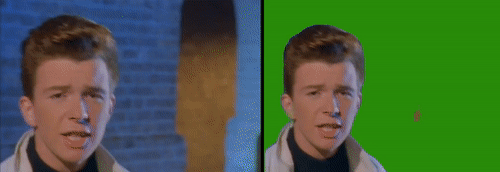

# Deep BGRemove



This is a quick tool that I whipped up for doing background removal using Pytorch's DeeplabV3 segmentation model. The pre-trained weights are used and downloaded from the Pytorch Hub, so getting up and running should be fairly easy. MoviePy is used for processing and I/O and it accepts a variety of formats. Cuda will be used if it is available on the system (you will want to use it as generating the output can be very slow, especially for large videos).

Mask movies can be brought into a tool like After effects and used as an alpha channel. 

## Installation
Install the requirements.
```bash
pip install -r requirements.txt
```

## Usage

```bash
python createmask.py --input "avideo.mp4" --output "output.mp4"
```

Optionally use `--width` to resize the input, keeping aspect ratio. If you have 4k video, you should resize it down to 1080p for masking purposes otherwise it will take quite a while.

## Tips

You'll want to have a reasonably high res video as input (with a similar output size) - 720p or 1080p is recommended. Too low res, and it tends to miss the people or not mask them too acurately. Good quality video is important - the network has trouble with motion blur. The training data most likely is all in-focus, so the network works great on still photos but people in motion are not masked as well. Higher framerates may help reduce motion blur - I am still experimenting with this.

## Notes

The video processing aspect is based on MoviePy, which is a powerful video editor in it's own right. Adding more powerful editing commands would be possible fairly easily. I had originally wanted to implementing compositing in this script, but it looks like MoviePy has some limitations on how masks work and are processed, and syncronizing video streams lends itself more to visual tools anyway. But, this could change in the future.


